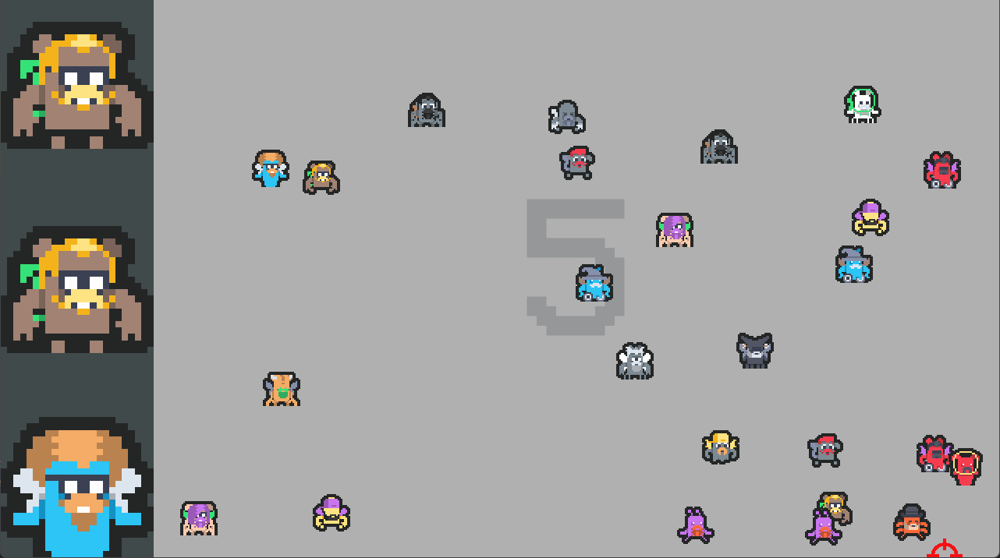

# Alien Hunter


**Alien Hunter** is a 2D arcade-style shooting game developed using Java and LibGDX. Players are tasked with identifying and shooting specific alien targets amidst a crowd of other aliens. As players progress through levels, the crowds become denser, increasing the challenge.




---

## 🎮 Play the Game

Experience **Alien Hunter** live at [tridvajedan.itch.io/alienassassin](https://tridvajedan.itch.io/alienassassin).

---

## 🛠️ Technologies Used

- **Java**: Core programming language.
- **LibGDX**: Game development framework.
- **Gradle**: Build automation tool.

---

## ⚙️ Installation

To run **Alien Hunter** locally:

1. Clone the repository:
```
git clone https://github.com/dimitrescu-dev/alien-hunter
```
3. Navigate to the project folder:
 ```
cd alien-hunter
 ```
3. Build the project using Gradle:
```
./gradlew build
 ```
4. Run the game:
```
./gradlew run
 ```
